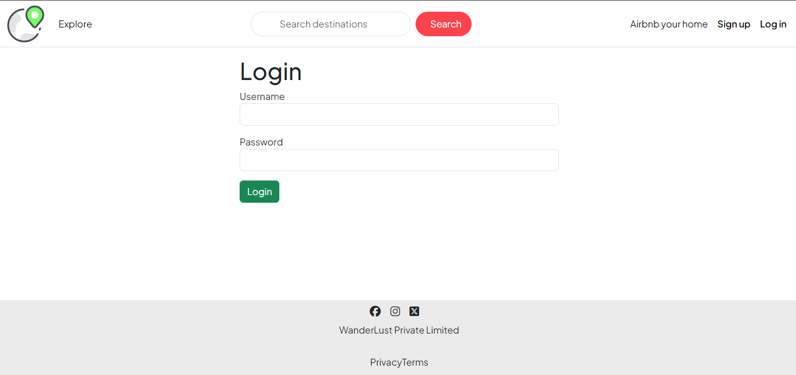
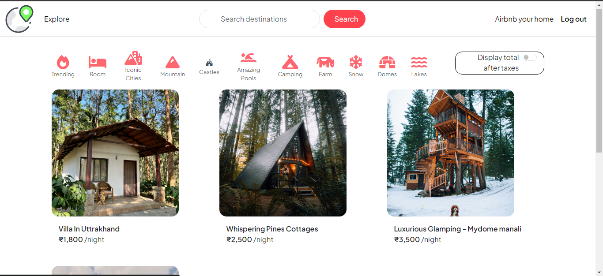

# StayBreeze 😋

Introducing "StayBreeze 😋" short-term housing rentals web application crafted with the powerful MERN stack—MongoDB, Express.js, EJS, and Node.js. This innovative platform seamlessly integrates the best of each technology to provide users with a Wonderful and efficient travel experience.

---
## Requirements

For development, you will only need Node.js and a node global package, installed in your environement.

### Node

If the installation was successful, you should be able to run the following command.

    $ node --version
    v12.22.12

    $ npm --version
    6.14.16

If you need to update `npm`, you can make it using `npm`! Cool right? After running the following command, just open again the command line and be happy.

    $ npm install npm -g

###

## Install

    $ git clone https://github.com/rrtiwari/project-3.git
    $ cd project-3
    $ npm install

## Running the project

    $ node app.js

# ScreenShots
<!-- ## SignIp Page -->

<!-- ## Home Page -->

---
<!-- ## Add Listing Page -->

---
